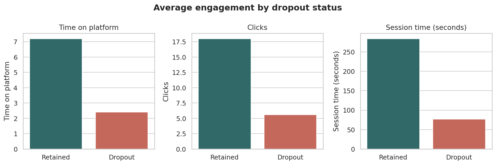

# User Behavior and Dropout Analysis

An exploratory product analytics case study examining how engagement indicators differ between retained and dropout users in a small simulated dataset.



## Business question

Which engagement signals are associated with user dropout in the available sample, and what should a product team measure next before making retention decisions?

## Project scope

This project demonstrates a transparent workflow for loading, validating, summarizing, and visualizing user-behavior data with Python and pandas. The dataset contains 10 simulated users, so the analysis is descriptive only. It does not claim causal effects, real-world business impact, or production-ready predictive performance.

## Dataset

The source file is [`data/users_behavior.csv`](data/users_behavior.csv). It contains 10 rows and 7 columns.

| Column | Description | Notes |
|---|---|---|
| `user_id` | Synthetic user identifier | Unique in the current file |
| `age` | User age in years | Simulated |
| `time_on_platform` | Relative time spent on the platform | The original dataset does not specify a unit |
| `clicks` | Number of clicks | The observation window is not specified |
| `session_time` | Session duration | Treated as seconds in this analysis |
| `decision` | Simulated yes/no decision outcome | The specific product decision is not defined |
| `drop_out` | Dropout indicator | `0` = retained, `1` = dropout |

The analysis deliberately preserves these uncertainties instead of inventing missing metadata.

## Analysis workflow

1. Load the CSV using a repository-relative path.
2. Validate required columns, missing values, duplicate user IDs, numeric ranges, and category values.
3. Calculate descriptive statistics for retained and dropout users.
4. Check the relationship between `decision` and `drop_out` for potential target leakage.
5. Create comparison charts and document limitations.

The executable workflow is available in [`notebooks/user_behavior_analysis.ipynb`](notebooks/user_behavior_analysis.ipynb). A script version is provided in [`src/analyze.py`](src/analyze.py) for reproducible command-line execution.

## Verified findings

Within this simulated 10-user sample:

| Metric | Retained users | Dropout users |
|---|---:|---:|
| Users | 5 | 5 |
| Average time on platform | 7.2 | 2.4 |
| Average clicks | 18.0 | 5.6 |
| Average session time | 284 seconds | 77 seconds |
| Average age | 26.6 years | 36.6 years |

- Dropout users show lower engagement across platform time, clicks, and session duration.
- `decision` and `drop_out` are perfectly aligned in all 10 rows: every `yes` corresponds to retention and every `no` corresponds to dropout.
- That perfect alignment means `decision` would leak the target into a dropout model and must not be used as a predictor without understanding when and how it is recorded.

These findings describe only the supplied sample. They are not evidence that low engagement causes dropout, and they should not be generalized to real users.

## Product interpretation

If this were a real product dataset, the next useful step would be to instrument engagement consistently and investigate users with declining session duration or click activity. Before acting, the team would need a larger time-based dataset, a documented dropout definition, event timestamps, acquisition channel, device, cohort, and conversion context.

## Why there is no machine-learning model

A predictive model would not be credible with 10 observations. A train/test split would contain too few examples, and the perfect relationship between `decision` and `drop_out` creates direct leakage. Reporting accuracy, ROC-AUC, feature importance, or retention impact from this dataset would therefore be misleading.

## Repository structure

```text
.
├── data/
│   ├── README.md
│   └── users_behavior.csv
├── notebooks/
│   └── user_behavior_analysis.ipynb
├── reports/
│   └── figures/
│       ├── decision_dropout_matrix.png
│       └── engagement_by_dropout.png
├── src/
│   └── analyze.py
├── .gitignore
├── LICENSE
├── README.md
└── requirements.txt
```

## Run locally

```bash
git clone https://github.com/matiastechai-design/user-behavior-analyssis.git
cd user-behavior-analyssis
python -m venv .venv
```

Activate the environment:

```bash
# macOS/Linux
source .venv/bin/activate

# Windows PowerShell
.venv\Scripts\Activate.ps1
```

Install dependencies and run the reproducible script:

```bash
pip install -r requirements.txt
python src/analyze.py
```

To explore the notebook:

```bash
jupyter notebook notebooks/user_behavior_analysis.ipynb
```

## Limitations and next steps

- Replace or supplement the 10-row sample with a larger, documented dataset.
- Define the units and observation windows for all engagement variables.
- Add timestamps so retention and dropout can be evaluated by cohort.
- Establish whether `decision` occurs before or after dropout; exclude it from modeling if it contains future information.
- When sufficient data exists, establish a simple baseline and use time-aware validation before testing more complex models.

## Technology

Python, pandas, matplotlib, seaborn, and Jupyter Notebook.

## License

This project is available under the [MIT License](LICENSE).
